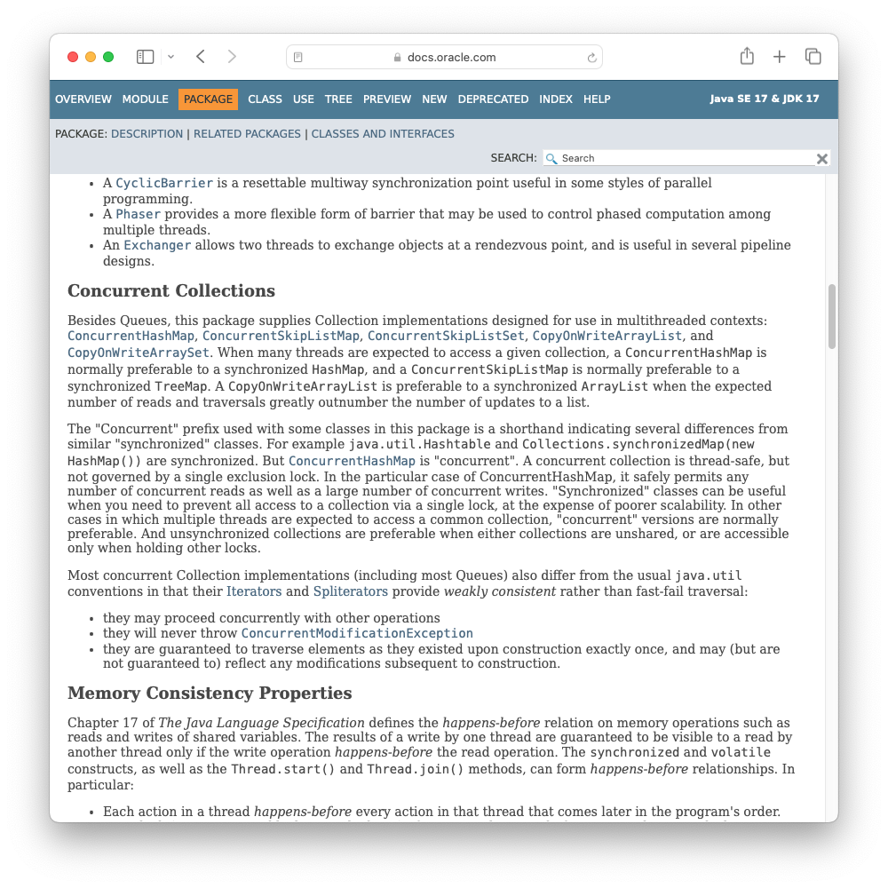

<!--
theme: gaia
size: 16:9
paginate: true
author: L. Delafontaine and H. Louis, with the help of AI tools
title: HEIG-VD DAI Course - Practical work 3
description: Practical work 3 for the DAI course at HEIG-VD, Switzerland
url: https://heig-vd-dai-course.github.io/heig-vd-dai-course/18-practical-work-3/
footer: '**HEIG-VD** - DAI Course 2023-2024 - CC BY-SA 4.0'
style: |
    :root {
        --color-background: #fff;
        --color-foreground: #333;
        --color-highlight: #f96;
        --color-dimmed: #888;
        --color-headings: #7d8ca3;
    }
    blockquote {
        font-style: italic;
    }
    table {
        width: 100%;
    }
    th:first-child {
        width: 15%;
    }
    h1, h2, h3, h4, h5, h6 {
        color: var(--color-headings);
    }
    h2, h3, h4, h5, h6 {
        font-size: 1.5rem;
    }
    h1 a:link, h2 a:link, h3 a:link, h4 a:link, h5 a:link, h6 a:link {
        text-decoration: none;
    }
    section:not([class=lead]) > p, blockquote {
        text-align: justify;
    }
headingDivider: 4
-->

[web]:
  https://heig-vd-dai-course.github.io/heig-vd-dai-course/18-practical-work-3/
[pdf]:
  https://heig-vd-dai-course.github.io/heig-vd-dai-course/18-practical-work-3/18-practical-work-3-presentation.pdf
[license]:
  https://github.com/heig-vd-dai-course/heig-vd-dai-course/blob/main/LICENSE.md
[discussions]: https://github.com/orgs/heig-vd-dai-course/discussions/118
[illustration]:
  https://images.unsplash.com/photo-1636357582639-27620e21d7c5?fit=crop&h=720
[practical-work]:
  https://github.com/heig-vd-dai-course/heig-vd-dai-course/blob/main/18-practical-work-3/COURSE_MATERIAL.md
[practical-work-qr-code]:
  https://quickchart.io/qr?format=png&ecLevel=Q&size=400&margin=1&text=https://github.com/heig-vd-dai-course/heig-vd-dai-course/blob/main/18-practical-work-3/COURSE_MATERIAL.md

# Practical work 3

<!--
_class: lead
_paginate: false
-->

<https://github.com/heig-vd-dai-course>

[Web][web] · [PDF][pdf]

<small>L. Delafontaine and H. Louis, with the help of AI tools.</small>

<small>This work is licensed under the [CC BY-SA 4.0][license] license.</small>

![bg opacity:0.1][illustration]

## Practical work 3

- An UDP network application
- You can choose what the network application will do (a sophisticated chat
  application, a game of cooperation, the simulation of an IoT network, ...)
- Share your application on GitHub with Docker and Docker Compose
- Groups between 2 and 3 students

![bg right:40%][illustration]

## Demo

<!-- _class: lead -->

---


---

Compile the project:

```sh
./mvnw clean package
```

Run the CLI without any arguments:

```sh
java -jar target/practical-work-3-demo-1.0-SNAPSHOT.jar
```

---

```text
Missing required subcommand
Usage: practical-work-3-demo-1.0-SNAPSHOT.jar [-hV] [COMMAND]
DAI Weather Station
  -h, --help      Show this help message and exit.
  -V, --version   Print version information and exit.
Commands:
  thermometer-emitter      Emits temperature values.
  pressure-emitter         Emits pressure values.
  humidity-emitter         Emits humidity values.
  weather-station          Start an UDP multicast receiver.
  weather-client           Start an UDP weather client.
  list-network-interfaces  List all available network interfaces.
```

---

Start the weather station:

```sh
java -jar target/practical-work-3-demo-1.0-SNAPSHOT.jar weather-station \
  -i eth0 \
  --port 9876 \
  --server-port 1234
```

Output:

```text
Multicast receiver started (10.11.12.25:9876)
Unicast receiver started (10.11.12.25:1234)
```

---

Start the emitters:

```sh
java -jar target/practical-work-3-demo-1.0-SNAPSHOT.jar thermometer-emitter \
  --delay=0 \
  --frequency 10000 \
  -i eth0 \
  -p 9876

java -jar target/practical-work-3-demo-1.0-SNAPSHOT.jar pressure-emitter \
  --delay=0 \
  --frequency 10000 \
  -i eth0 \
  -p 9876
```

---

Output:

```text
Emitter of type thermometer started (10.11.12.25:9876).
Multicasting measure : 30.0 to 239.0.0.1:9876 on interface en0
Multicasting measure : 23.0 to 239.0.0.1:9876 on interface en0
Multicasting measure : 28.0 to 239.0.0.1:9876 on interface en0
Multicasting measure : 19.0 to 239.0.0.1:9876 on interface en0
Multicasting measure : 15.0 to 239.0.0.1:9876 on interface en0
```

```text
Emitter of type pressure started (10.11.12.25:9876).
Multicasting measure : 982.0 to 239.0.0.2:9876 on interface en0
Multicasting measure : 1027.0 to 239.0.0.2:9876 on interface en0
Multicasting measure : 970.0 to 239.0.0.2:9876 on interface en0
Multicasting measure : 996.0 to 239.0.0.2:9876 on interface en0
Multicasting measure : 982.0 to 239.0.0.2:9876 on interface en0
```

---

Start the weather client:

```sh
java -jar practical-work-3-demo-1.0-SNAPSHOT.jar weather-client
```

Output:

```text
Welcome to the weather client!
Please enter the measures you want to get
1. Temperature
2. Humidity
3. Pressure
4. Quit
>
```

You can then select the measures you want to get.

---

```text
> 1
List all measures (1) or only the average? (2)
> 1
----------------------------------------
Received measures: [30.0, 23.0, 28.0, 19.0, 15.0]
----------------------------------------
Please enter the measures you want to get
1. Temperature
2. Humidity
3. Pressure
4. Quit
>
```

The client will then display all the measures received from the weather station.

---

```text
> 3
List all measures (1) or only the average? (2)
> 2
----------------------------------------
Received average: 991.11
----------------------------------------
Please enter the measures you want to get
1. Temperature
2. Humidity
3. Pressure
4. Quit
> 4
```

The client will then display the average of the measures received from the
weather station.

## Tips for the practical work

The next slides present the implementation details and some tips to manage
concurrency.

You can find more details in the practical course material on
[GitHub][practical-work].

---

In this practical work, you will be facing concurrency issues. Concurrency
happens when two or more threads access the same shared data at the same time
(read and write).

This is not a concurrency course! We will not penalize you if you do not use
concurrency perfectly in your application.

However, we think it is a good opportunity to learn about concurrency and we
will be happy to help you if you want to use it.

### Concurrency with UDP

<!-- _class: lead -->

You can find more details in the practical course material on
[GitHub][practical-work].

### Concurrent collections

- To avoid concurrency issues, Java provides a set of **concurrent collections**
  that can be used to share data between threads.
- These collections are **thread-safe**, which means that they can be accessed
  by multiple threads at the same time.
- You can find all the concurrent collections in the
  [`java.util.concurrent`](https://docs.oracle.com/en/java/javase/17/docs/api/java.base/java/util/concurrent/package-summary.html)
  package.
- Other solutions exist to manage concurrency (Futures, Mutex, Semaphores, ...).
  This will be covered in the PCO course.

---

Some useful collections are:

- `ConcurrentHashMap`
- `CopyOnWriteArrayList`
- `CopyOnWriteArraySet`
- `ConcurrentLinkedDeque`
- `ConcurrentLinkedQueue`

These collections might be useful for your practical work.



### Run multiple tasks in parallel

<!-- _class: lead -->

You can find more details in the practical course material on
[GitHub][practical-work].

## Practical work review

The practical work review will take place on **Tuesday 19.12.2023** in the
**room B38**, at the very end of the corridor next to the door entry.

We only have **10 minutes per group** (6 minutes of presentation, 3 minutes of
questions). Please be prepared to present your work. You decide what you want to
show us and how you want to present it.

Come 5 minutes before your time slot with your computer.

The order of presentation is random and is stated in the next slides.

---

<!--
**Please state your group on GitHub Discussions as soon as possible, even if you
do not have a clear idea yet as it will help us to plan the practical work
review.**
-->

| #   | Group                                   | Passage |
| --- | --------------------------------------- | ------- |
| 1   | Loïc Herman and Massimo Stefani?        | 13:45   |
| 2   | Ahmad Jano and Sergey Komarov?          | 13:55   |
| 3   | Alexandre Philibert and Valentin Ricard | 14:05   |
| 4   | Sebastian Diaz and Thomas Vuilleumier   | 14:15   |
| 5   | Colin Jaques and Walid Slimani?         | 14:25   |
| 6   | Lionel Pollien and Arthur Menétrey      | 14:35   |
|     | Break                                   |         |
| 7   | Gwendal Piemontesi and Guillaume Trueb  | 16:45   |

---

| #   | Group                                              | Passage |
| --- | -------------------------------------------------- | ------- |
| 8   | Alan Sottile and Calvin Graf                       | 16:55   |
| 9   | Alexandre Iorio and Theodros Mulugeta              | 17:05   |
| 10  | Richard Aurélien and Pirakas Anthon                | 17:15   |
| 11  | Olin Bourquin, Kevin Farine and Simon Guggisberg   | 17:25   |
| 12  | Jonas Troeltsch, Sarah Jallon and Jeremiah Steiner | 17:35   |
| 13  | Lucas Lattion and Romain Humair                    | 17:45   |
| 14  | Lopez Esteban and Bleuer Rémy                      | 17:55   |

## Find the practical work

<!-- _class: lead -->

You can find the practical work for this part on [GitHub][practical-work].

[![bg right w:75%][practical-work-qr-code]][practical-work]

## Grades and feedback

Grades will be entered into GAPS, followed by an email with the feedback.

The evaluation will use exactly the same grading grid as shown in the course
material.

Each criterion will be accompanied by a comment explaining the points obtained,
a general comment on your work and the final grade.

If you have any questions about the evaluation, you can contact us!

## Finished? Was it easy? Was it hard?

Can you let us know what was easy and what was difficult for you during this
practical work?

This will help us to improve the course and adapt the content to your needs. If
we notice some difficulties, we will come back to you to help you.

➡️ [GitHub Discussions][discussions]

You can use reactions to express your opinion on a comment!

## Sources

- Main illustration by [Jorge Ramirez](https://unsplash.com/@jorgedevs) on
  [Unsplash](https://unsplash.com/photos/a-cell-phone-tower-in-a-park-with-a-lake-in-the-background-0vmMg1r7FRU)
